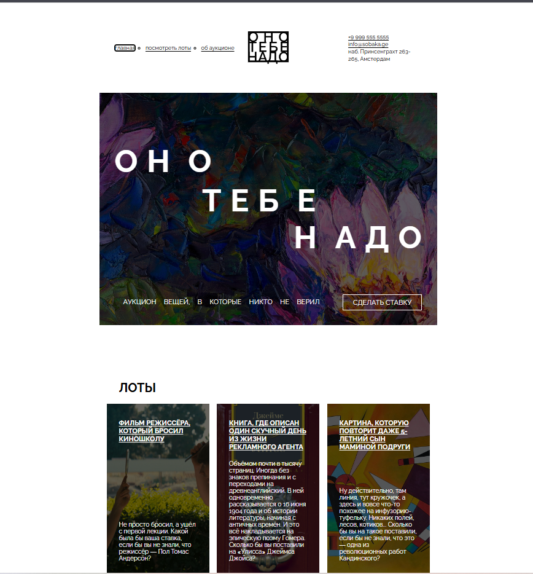

# 🏛️ Проект «Оно тебе надо»

[🔗 Посмотреть демо (Desktop)](https://annenkov-konstantin.github.io/ono-tebe-nado/) • [💻 Исходный код](https://github.com/Annenkov-Konstantin/ono-tebe-nado) • [🎨 Макет в Figma](https://www.figma.com/design/6POyOfIrRoH3msdtO7GjDL/%D0%9E%D0%BD%D0%BE-%D1%82%D0%B5%D0%B1%D0%B5-%D0%BD%D0%B0%D0%B4%D0%BE--Copy-?node-id=0-1&t=1D3fcgbSmtZiiSUs-1)

Семантический лендинг аукциона, созданный как демонстрация сложной десктопной вёрстки. Главная фишка проекта — сохранение целостности и точности сложного графического дизайна, рассчитанного исключительно на большие мониторы.

---

## 💡 Концепция и подход

Этот проект реализован в парадигме **Desktop-Only**.

Дизайн лендинга отличается сложной композицией, нестандартной сеткой и специфической типографикой, которые формируют единое визуальное пространство. Механическое сжатие такого макета под мобильные экраны разрушило бы его композицию и логику. Поэтому в рамках этого проекта было принято осознанное решение сфокусироваться на идеальной реализации для десктопных разрешений (от 1200px), что является стандартной практикой для сложных промо-сайтов, презентационных лендингов и арт-проектов.

---

## 📸 Превью



---

## ✨ Ключевые особенности реализации

### 1. Сложная сетка и позиционирование
Вместо стандартных блочных потоков используется продвинутое сочетание **CSS Grid** и **Flexbox**:
- Сложная сетка секции «Об аукционе» с использованием именованных областей (`grid-template-areas`).
- Точное позиционирование элементов с помощью `z-index` и абсолютного позиционирования для создания эффекта наложения (оверлеи, градиенты).

### 2. Pixel-Perfect и работа с пространством
- Отклонение от макета составляет менее **2px**.
- Особое внимание уделено «воздуху» (отступам) и пропорциям, которые корректно читаются только на широких экранах.
- Кастомная типографика с использованием `letter-spacing` и `text-transform` для создания уникального визуального ритма.

### 3. Чистая семантика и доступность (a11y)
Несмотря на сложность визуала, разметка остается чистой и логичной:
- Использование семантических тегов (`<header>`, `<main>`, `<section>`, `<footer>`, `<address>`).
- Правильная иерархия заголовков (`h1` -> `h2` -> `h3`).
- Атрибуты `alt` для изображений и `aria-label` для навигации.

### 4. Компонентный подход (БЭМ)
Стили написаны по методологии БЭМ, что позволяет легко переиспользовать блоки (например, блок адреса или карточки лотов) без конфликтов специфичности.

---

## 🛠 Технологии


**Методология:** БЭМ (Блок-Элемент-Модификатор)
**Подход:** Desktop-First, Pixel Perfect, Semantic HTML
**Оптимизация:** Семантическая разметка, доступность (a11y)

---

## 📁 Структура проекта

```
ono-tebe-nado/
├── index.html              # Главная страница
├── styles/
│   ├── global.css          # Глобальные (базовые) стили и сброс
│   └── style.css           # Основные стили компонентов
├── images/
│   ├── content/            # Контентные изображения
│   └── icons/              # Иконки и логотипы
├── fonts/                  # Шрифты и подключение (@font-face)
└── screenshots/            # Скриншоты для README
```

---

## 🚀 Как запустить локально

1. Клонируйте репозиторий:
   ```bash
   git clone https://github.com/Annenkov-Konstantin/ono-tebe-nado.git
   ```

2. Перейдите в папку проекта:
   ```bash
   cd ono-tebe-nado
   ```

3. Откройте файл `index.html` в любом современном браузере.

> 💡 Для корректного отображения рекомендуется использовать десктопную версию браузера с шириной окна **от 1200px**.

---

## 📝 Чек-лист качества

- ✅ W3C HTML валидатор — 0 ошибок
- ✅ W3C CSS валидатор — 0 ошибок
- ✅ Pixel Perfect — отклонение < 5px (на разрешениях 1920x1080 и 1440x900)
- ✅ Семантическая разметка (header, main, section, footer, address)
- ✅ Доступность (alt-тексты, правильная иерархия заголовков, aria-атрибуты)

---

<div align="center">
  <sub>Создано с ❤️ и вниманием к деталям</sub>
</div>